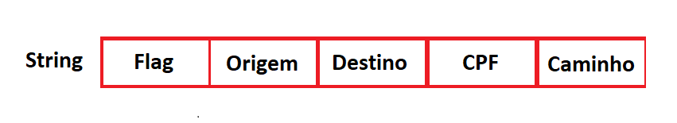
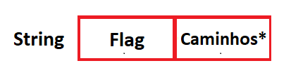
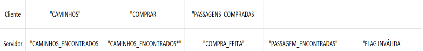
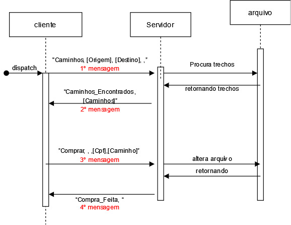
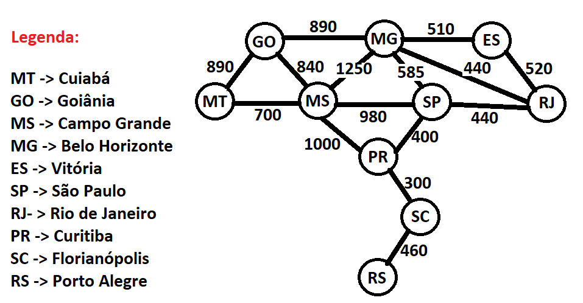

# VENDEPASS: Venda de Passagens

## Introdução

No mundo atual, faz-se necessário - em muitos casos - a fragmentação de uma estrutura monolítica e rígida em partes menores, esse é o caso do setor de aviação de baixo custo, que através dessa divisão criou uma estrutura barata e muito mais acessível para voos. Essa fragmentação foi usada tanto na logística operacional interna da empresa, quanto na ideia de um servidor central que possa ser acessado por clientes de forma autônoma. Para isso, entretanto, faz-se necessário o estabelecimento de um servidor robusto que possa conseguir responder a diversos clientes, de uma maneira eficaz e segura, e que exponha um conjunto de métodos de comunicação servidor-cliente. Do lado dos clientes, é necessário também a criação de uma entidade instanciável para escolha e compra de passagens, que usará dos métodos do servidor para atualização de informações relevantes. Além disso, um formato de dados que seja comumente compreensível entre servidor e cliente deve ser usado. Foi escolhido o formato JSON (JavaScript Object Notation) para o propósito de armazenamento de informações dos voos. 

Para a implementação, foi usado o subsistema de rede TCP/IP, usando uma API socket básica para comunicação. O projeto em sua completude foi feito usando a linguagem de programação Python, que oferecia recursos diversos como Mutexes e Threads, que foram de vital importância para o problema, principalmente no tocante ao acesso simultâneo. Além disso, foi usado uma biblioteca de grafos para organização de rotas, por distância e disponibilidade. Por fim, para uma melhor confiabilidade no uso e teste, foi adotado o uso de conteinerização com o Docker, promovendo estabilidade nos mais variados ambientes de utilização.

Como resultado, criou-se uma estrutura servidor-cliente onde um servidor pode aceitar diversos clientes simultaneamente de forma que um cliente não interfira com a compra do outro. Existe ainda estabilidade em relação a conexão, no sentido que ela ocorre num período pequeno - somente no intervalo de envio e recebimento de dados - já ocorrendo a desconexão. No geral o sistema é ”stateless”, por não guardar informações relevantes entre requisições e pela estrutura supracitada.

## Metodologia e Resultados

**Arquitetura**: O sistema apresenta uma estrutura onde um servidor dispõe de um conjunto de métodos para troca de informações com os clientes. Esse servidor é apoiado por dois arquivos no formato JSON. O primeiro para armazenamento de informações de passagens (que registrará informações como distância, trajeto, valor e outros, para uma pessoa) e o segundo, será um arquivo que conterá em si os trechos e assentos disponíveis para aquele trecho, além de também salvar informações sobre os passageiros, como o CPF. 

Os módulos do cliente são apoiados por sub-módulos:
* O primeiro está relacionado a utilidades, como cálculo de distâncias e limpeza de terminais (utils_cliente).
* O segundo é chamado ‘’interface’’. Que é um sub-módulo responsável por toda interatividade por parte do cliente. Contém métodos que mostram menus, seleção de cidades de origem, destino e caminho (conjunto de trechos) escolhido. É um “módulo meio” responsável por coletar ‘’inputs’’ e passar para a parte de processamento.
* O último, comum também ao servidor, é o ‘’connection’’, ele é o responsável por implementar toda lógica de comunicação. De funções usadas pelo cliente deste módulo estão: conectar cliente com o servidor, enviar e receber mensagens (para o servidor), e desconexão (encerrar conexão) com servidor, além de funções de teste de conexão, usadas para casos onde a queda ocorre.

Já o módulo do servidor é apoiado por dois sub-módulos:
* O primeiro é relacionado a utilidades do servidor, como a criação do grafo de trechos (já predefinido), carregar o grafo (trechos de viagem), carregar as passagens já compradas, salvar grafos e passagens, e encontrar caminhos.
* O último, é o ‘’connection’’, em si está contido funções de configuração de servidor (criação e configuração do socket, associação a uma endereço/porta e estabelecer o número máximo de conexão da fila), receber dados, encerrar conexão e testar conexão (usado quando é necessário saber se ainda existe conexão).

**Paradigma de Comunicação**: O paradigma aplicado foi o "Stateless", visto que cada nova requisição é tratada de forma independente e separada de outras pelo servidor, de forma que o servidor não mantém informações do cliente entre as requisições. Foi escolhido esse paradigma tanto pela escalabilidade - podendo replicar o servidor - de modo que as mais diversas solicitações, nos mais diversos ‘’estágios de compra’’ pudessem ser tratado por qualquer instância desse ‘’server’’, mesmo se uma instância caísse - e até se essa  instância caísse e retornasse - a outra poderia continuar, visto que o servidor não mantém informações. Além disso, existe a redução de complexidade, no sentido de ficar salvando estados. Por fim, para a ideia proposta de conexão somente para envio e recebimento de dados e uso de flags, esse foi o melhor modelo para o servidor.

**Protocolo de comunicação**: 

Formato das mensagens: Em relação ao formato das mensagens, o protocolo adota uma estrutura de mensagem como uma ‘’string’’, onde cada campo é separado por vírgulas. Abaixo as mensagem para uma comunicação Cliente → Servidor (cliente enviando mensagem), sempre de tamanho 5, como mostra a Figura 1:

  

<strong> Figura 1. Mensagem Cliente -> Servidor </strong>

</strong>

De outro modo, Servidor → Cliente (servidor enviando mensagem), sempre tamanho 2, como mostra a Figura 2:

  

<strong> Figura 2. Mensagem Servidor -> Cliente </strong>

</strong>

Independente de quem envie a informação, o outro lado sempre tem uma forma de recebê-la. O último campo da ‘’string’’ acima é flexível, podendo retornar as passagens do usuário também.

A estrutura das mensagens sempre são respeitadas, mesmo que alguns campos possam ter valor vazio. Todos os campos são autoexplicativos, exceto a “Flag”. Na tabela abaixo, as “Flags” na linha “Cliente” indicam uma comunicação do tipo Cliente → Servidor, de modo que quem cria a “Flag” e envia é o cliente. Na linha “Servidor”, o contrário acontece.

* Flag → indica o tipo de solicitação e como o outro lado deve respondê-la, na Figura 3 as possíveis ‘’flags’’:

  

<strong> Figura 3. Tipos de Flag por entidade </strong>

</strong>

As mensagens possíveis por parte do cliente são: 

| Mensagem (Cliente)                        | Significado                                                |
|-------------------------------------------|------------------------------------------------------------|
| "Caminhos, [Origem], [Destino], ,”        | Solicitando caminhos entre [Origem] e [Destino].            |
| ”Comprar, , ,[Cpf],[Caminho]”             | Comprando uma passagem para o [Caminho].                    |
| “Passagens_Compradas, , ,[Cpf]”           | Solicitando passagens compradas por [Cpf].                  |

Por parte do servidor:

  
| Mensagem (Servidor)                        | Significado                                                |
|--------------------------------------------|------------------------------------------------------------|
| “Caminhos_Encontrados, [Caminhos]”         | Retornando caminhos entre Origem-Destino.                  |
| “Novos_Caminhos_Encontrados, [Caminhos]”   | Se o caminho escolhido não existe mais, retorna novos.      |
| “Compra_Feita, ”                           | Confirmando a compra de uma passagem pelo [Caminho].        |
| “Passagens_Encontradas, [Passagens]”       | Passagens compradas por [Cpf].                             |
| “Flag_Invalida, ”                          | Operação não identificada.                                 |

A Figura 4, exemplifica o fluxo de mensagens para uma compra bem sucedida:

  

<strong> Figura 4. Fluxo de mensagens para uma compra bem sucedida </strong>

</strong>

**Formatação e tratamento de dados**:Para formatação de dados foi usado o sistema JSON, que é um sistema de arquivo baseado em dicionários e listas. Com o JSON foram criados dois tipos de arquivos como já citado anteriormente, um para passagens e outro para trechos e caminhos. A estrutura do arquivo para passagens é um dicionário que tem como chaves o CPF e valor uma lista que contém todas as compras desse CPF. Cada compra é um dicionário com os caminhos, assentos, distância e valor da viagem como chaves.
Já o arquivo de trechos, são os diversos trechos que, quando combinados formam um caminho. Tem a estrutura de um dicionário onde as chaves são tuplas que contém um “trecho” (ex: “São paulo”, “Rio de Janeiro”) e valor um dicionário que contém como chaves distância, assentos e CPFs das pessoas que viajarão por aquele trecho) .

O grafo da Figura 5 foi usado como base para composição de trechos e caminhos, a sigla do estado é usada para referenciar as capitais dos estados.

  

<strong> Figura 5. Grafo de rotas e caminhos </strong>

</strong>

**Tratamento de conexões simultâneas e Tratamento de Concorrência**:O sistema não permite a compra de forma 100% paralela. Apesar de ser possível diversos clientes estarem comprando - com múltiplas threads sendo disparadas  - (cada thread sendo um cliente), quando o processamento de uma compra acontece, é usado um Mutex para travar aquela região de acesso aos dados dos arquivos, isso é feito para que não exista erros de disponibilidade de passagens durante a compra. Enquanto a região está travada, a outra solicitação de acesso ao arquivo fica esperando até que o ‘’lock’’ seja suspenso. Para otimizar ainda mais o paralelismo poderia retirar o ‘’lock’’ nos  momentos de somente leitura de dados, apesar que fazendo isso, existiria a chance de dados desatualizados serem repassados para outros usuários. Poderia também aplicar uma forma de verificação baseada na interseccionalidade entre trechos e rotas, só ‘’travando’’ uma compra se existisse uma compra atual, que tivesse trechos em comum. 

**Documentação do código**:O código está completamente comentado e documentado.

**Emprego do Docker**:O código faz uso da conteinerização com Docker, para, como mencionado anteriormente, proporcionar uma ambiente seguro e confiável para testes. Foi criado um Docker para o servidor, com uma imagem 3.12-slim, instalando as bibliotecas necessárias para grafo e sub-módulos além do ‘’EXPOSE’’ na porta usada. Para o Docker do cliente, foi a mesma imagem python e foi carregado os sub-módulos. Por fim, criou-se um Docker Compose, para orquestrar e criar uma rede que ligasse o Docker do servidor com o do cliente.

**Desempenho e avaliação**:O sistema faz uso de Threads, sendo que cada uma é disparada para cada solicitação do cliente, isso faz com que exista uma redução no tempo entre solicitações dos mais diversos clientes. Além disso, a fila de solicitação para requisições foi ajustada para 50. De modo que é possível armazenar 50 requisições enquanto uma está sendo passada para uma thread. O desempenho do sistema foi satisfatório. Foi feito um script que criou 50 terminais solicitando a mesma coisa, o servidor conseguiu processar todas solicitações e não deixou que uma mesma passagem fosse comprada quando não estivesse mais disponível. 

**Confiabilidade da solução**:Foram feitos diversos testes em relação à desconexão, de modo que o sistema continuou funcionando.
* O primeiro foi quando o servidor é desconectado, após os trajetos serem retornados pelo servidor, se o cliente tentar enviar dados falhará pois o servidor não estará disponível. Mas se o cabo do servidor for conectado, é possível prosseguir a compra a partir daquele momento, a base disso é o fato do servidor ser “stateless”.
* O segundo teste é parecido com o primeiro, mas agora se o cliente é desconectado, logo após a fase de envio de origem e destino, o cliente consegue voltar e escolher/comprar entre um dos caminhos retornados dá origem ao destino.

Foi adicionado tanto para cliente quanto para o servidor um tempo de espera para enviar, receber e se conectar (entre si), usada em casos onde após um tempo excedido (10 segundos) é retornado um erro de temporização. Além disso, excedido esse tempo, o cliente volta sempre para o início do estágio onde estava.

# Conclusão

